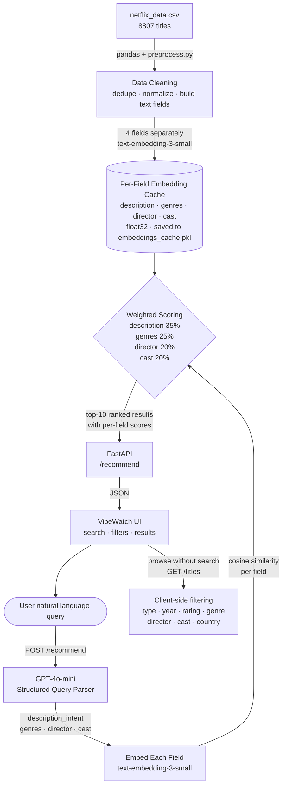
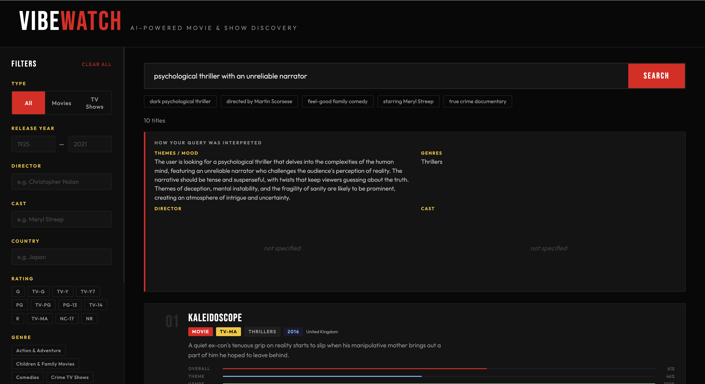
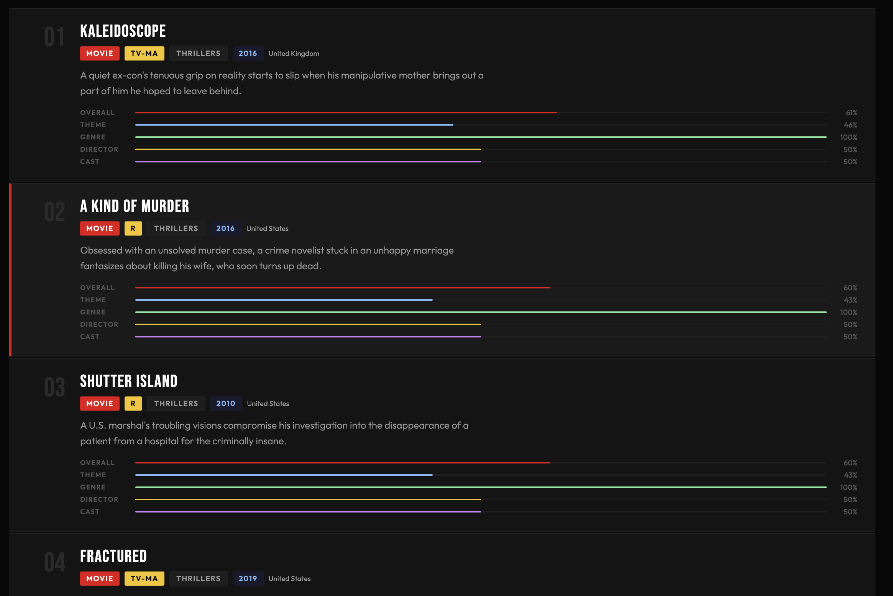

# VibeWatch — Movie & TV Show Recommender

A content-based movie and TV show recommender built on the Netflix dataset (~8,800 titles), powered by OpenAI embeddings and GPT-4o-mini for natural language query parsing.

---

## Quick Start

```bash
docker build -t movie-recommender .
docker run -p 8080:80 --env-file .env movie-recommender
```

Create a `.env` file in the project folder:
```
OPENAI_API_KEY=sk-...your_key_here
```

Then open **http://localhost:8080**

> **First run only:** embeds all 8,807 titles via OpenAI (~2 minutes). All subsequent runs load from cache and start instantly.

---

## AI Setup

| Setting | Value |
|---|---|
| **Provider** | OpenAI |
| **Embedding model** | `text-embedding-3-small` |
| **LLM model** | `gpt-4o-mini` (query parsing only) |
| **Required env var** | `OPENAI_API_KEY` |

Get your API key at: https://platform.openai.com/api-keys

---

## Architecture



**Data flow:**
1. On startup, `preprocess.py` cleans the CSV — removes duplicates, normalizes genres, caps cast lists to 5 names
2. Each title is embedded as **4 separate vectors** (description, genres, director, cast) using `text-embedding-3-small` and cached to disk
3. On search, `gpt-4o-mini` parses the user's free-form query into structured fields: `description_intent`, `genres`, `director`, `cast`
4. Each field is embedded independently and scored via cosine similarity against its matching matrix
5. Final score = weighted sum across all 4 fields — director/cast matches are never drowned out by generic description similarity
6. Top 10 results returned with per-field score breakdown

---

## Recommendation Approach

### Structured field-level embeddings
Unlike typical recommenders that mash all metadata into one text blob, VibeWatch embeds each field separately. This means a search for "directed by Christopher Nolan" produces a strong director-field signal that dominates the ranking — it cannot be diluted by unrelated description similarity.

### LLM query parsing
Free-form queries like *"something dark and suspenseful set in Japan"* are first passed through `gpt-4o-mini`, which extracts structured fields:

```json
{
  "description_intent": "A dark, suspenseful psychological thriller...",
  "genres": "Thrillers, International Movies",
  "director": "",
  "cast": ""
}
```

Each field is then embedded independently and matched against its corresponding per-field matrix.

### Weighted cosine similarity
```
final_score = 0.35 × description_sim
            + 0.25 × genre_sim
            + 0.20 × director_sim
            + 0.20 × cast_sim
```

The UI shows a per-field score breakdown for every result so the user can see exactly why each title ranked where it did.

### Browse mode
Users can browse the full dataset without searching — filters (type, year, rating, genre, director, cast, country) apply instantly client-side with no API calls.

---

## Project Structure

```
movie-recommender/
├── main.py            # FastAPI backend — /recommend, /titles endpoints
├── recommender.py     # Embedding, query parsing, scoring logic
├── preprocess.py      # Data cleaning pipeline
├── static/
│   └── index.html     # Single-page UI
├── netflix_data.csv   # Source dataset (8,807 titles)
├── requirements.txt
├── Dockerfile
├── nginx.conf         # Reverse-proxies port 80 → uvicorn :8000
└── start.sh           # Starts nginx + uvicorn together
```

---

## Demo

> Search: *"psychological thriller with an unreliable narrator"*

The system parses this into structured intent, embeds each field, scores all 8,807 titles, and returns ranked results with a per-field score breakdown showing exactly why each title matched.



---

## Notes

- Embeddings are cached to `embeddings_cache.pkl` after the first run
- To persist the cache across Docker restarts: `docker run -p 8080:80 --env-file .env -v $(pwd)/cache:/app movie-recommender`